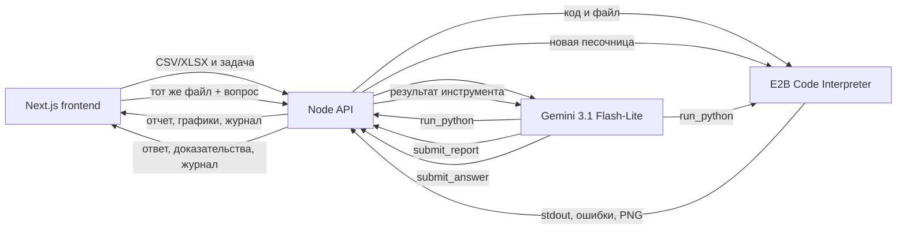

# Разбор

Веб-продукт для агентного анализа CSV и Excel. Пользователь загружает файл, при необходимости пишет задачу, а LLM самостоятельно исследует данные через Python-интерпретатор E2B и возвращает метрики, графики, инсайты и журнал выполненного кода.

## Почему решение агентное

Датасет не преобразуется сервером в готовую статистику для промпта. Gemini получает путь к файлу и сама управляет циклом анализа:

1. Вызывает инструмент `run_python`.
2. Python-код выполняется в изолированной E2B-песочнице.
3. stdout, ошибки и графики возвращаются модели как результат инструмента.
4. Модель уточняет анализ дополнительными вызовами.
5. После минимум двух успешных запусков модель вызывает `submit_report`.
6. После отчета браузер сохраняет выбранный пользователем файл.
7. В чате файл повторно отправляется вместе с вопросом, а backend создает
   новую E2B-песочницу и требует еще один `run_python`.

В интерфейсе сохраняется журнал вызовов с кодом и фактическим выводом. Это позволяет показать преподавателю, что LLM действительно использовала интерпретатор.



## Возможности

- загрузка `.csv` и `.xlsx` до 10 МБ;
- пользовательская инструкция, на что обратить внимание;
- самостоятельная разведка структуры и качества данных;
- несколько итераций Python-кода;
- ключевые метрики и доказательные инсайты;
- графики Matplotlib/Seaborn из E2B;
- журнал Python-кода для проверки результата;
- полноэкранный чат по уже загруженному датасету;
- повторные Python-вычисления для каждого ответа в чате;
- устойчивость чата к перезапускам и нескольким инстансам backend;
- понятные состояния лимита Gemini/E2B с рекомендацией подождать;
- демонстрационный режим без API;
- адаптивный интерфейс для desktop и телефона;
- отдельные состояния загрузки, пустого результата и ошибок.

## Соответствие критериям на 5 баллов

| Критерий | Реализация |
| --- | --- |
| Анализ любого датасета | Агент сначала исследует реальные колонки и типы через pandas |
| Пользовательский контекст | Поле «Контекст и задача», лимит 2000 символов |
| Агентная работа | Цикл function calling `run_python` -> E2B -> Gemini |
| Интерпретатор кода | `@e2b/code-interpreter`, изолированная одноразовая среда |
| Графики | PNG/JPEG извлекаются из `execution.results` |
| Интерфейс | Next.js, drag-and-drop, отчет, журнал и полноэкранный чат |
| Диалог с датасетом | Файл прикрепляется заново; каждый вопрос вызывает Python в новой E2B sandbox |
| Prompt-injection | Разделение инструкций и данных, недоверенный tool output, фильтр Python, отсутствие интернета |

## Стек

- Next.js 16, React 19, TypeScript;
- Gemini Developer API;
- модель `gemini-3.1-flash-lite`;
- E2B Code Interpreter;
- Hono для backend API;
- Zod для проверки финального отчета;
- Vitest и ESLint.

## Локальный запуск

Требуется Node.js 22+ и pnpm 9.

```bash
pnpm install
cp .env.example .env
```

Заполните `.env`:

```env
GEMINI_API_KEY=новый_ключ
E2B_API_KEY=новый_ключ
GEMINI_MODEL=gemini-3.1-flash-lite
PORT=8787
ALLOWED_ORIGINS=http://localhost:3000
NEXT_PUBLIC_AGENT_API_URL=http://localhost:8787
```

Запустите два процесса:

```bash
pnpm dev:api
```

```bash
pnpm dev
```

Frontend: `http://localhost:3000`

Backend health check: `http://localhost:8787/health`

## Проверки

```bash
pnpm check
```

Команда запускает ESLint, TypeScript, 20 тестов и production build.

## Деплой

GitHub Pages размещает только статические файлы и не умеет безопасно выполнять серверный агентный код. Поэтому deployment состоит из двух частей.

### Backend на Render

Нажмите кнопку и подключите репозиторий:

[](https://render.com/deploy?repo=https://github.com/linsivs/llm-agent)

1. В Render подтвердите создание Blueprint из репозитория.
2. Render прочитает `render.yaml`.
3. Добавьте новые `GEMINI_API_KEY` и `E2B_API_KEY`.
4. После deploy скопируйте URL вида `https://razbor-agent-api.onrender.com`.
5. Проверьте `https://<backend-url>/health`.

Если GitHub-репозиторий был удален и создан заново, старый Render-сервис может
потерять webhook. В таком случае откройте сервис и нажмите
`Manual Deploy -> Deploy latest commit`, затем переподключите репозиторий в
настройках сервиса.

При использовании другого домена Pages измените `ALLOWED_ORIGINS` на точный origin frontend.

### Frontend на GitHub Pages

Frontend уже опубликован из ветки `gh-pages`:

[https://linsivs.github.io/llm-agent/](https://linsivs.github.io/llm-agent/)

Для автоматической пересборки после следующих изменений готовый workflow хранится в [`deploy/pages.yml`](deploy/pages.yml).

1. Обновите авторизацию:

   ```bash
   gh auth login -h github.com -s repo,workflow
   ```

2. Переместите workflow:

   ```bash
   mkdir -p .github/workflows
   mv deploy/pages.yml .github/workflows/pages.yml
   git add .github/workflows/pages.yml deploy/pages.yml
   git commit -m "ci: deploy frontend to pages"
   git push origin main
   ```

3. В GitHub откройте `Settings -> Secrets and variables -> Actions -> Variables`.
4. Создайте `NEXT_PUBLIC_AGENT_API_URL` со значением URL backend без завершающего `/`.
5. В `Settings -> Pages` выберите `Source: GitHub Actions`.

Адрес frontend: `https://linsivs.github.io/llm-agent/`.

## Получение скриншотов для отчета

1. Откройте production frontend.
2. Нажмите «Показать демо» или загрузите `public/samples/sales.csv`.
3. Сделайте скрин первого экрана, блока метрик и раскрытого журнала агента.
4. Нажмите «Продолжить анализ в чате» и задайте уточняющий вопрос.
5. Для мобильного скрина используйте ширину 390 px в DevTools.

Готовый текст отчета находится в [`docs/REPORT.md`](docs/REPORT.md).

## Безопасность

Подробная модель защиты описана в [`SECURITY.md`](SECURITY.md).

Ключи, опубликованные в переписке или истории Git, необходимо немедленно отозвать и выпустить заново. Секреты нельзя добавлять в `NEXT_PUBLIC_*`, исходный код или GitHub Pages.

## Ограничения

- бесплатные лимиты Gemini и E2B могут временно возвращать 429;
- Render Free может засыпать и запускаться несколько десятков секунд;
- каждый вопрос в чате повторно загружает файл и создает новую E2B-песочницу,
  поэтому ответ может занимать больше времени;
- результат LLM нужно проверять по журналу кода и исходным данным;
- `.xls` намеренно не поддерживается из-за устаревшего и менее безопасного формата.

## Лицензия

MIT. Код референсного репозитория не использовался: у указанного проекта отсутствует лицензия, разрешающая копирование.
